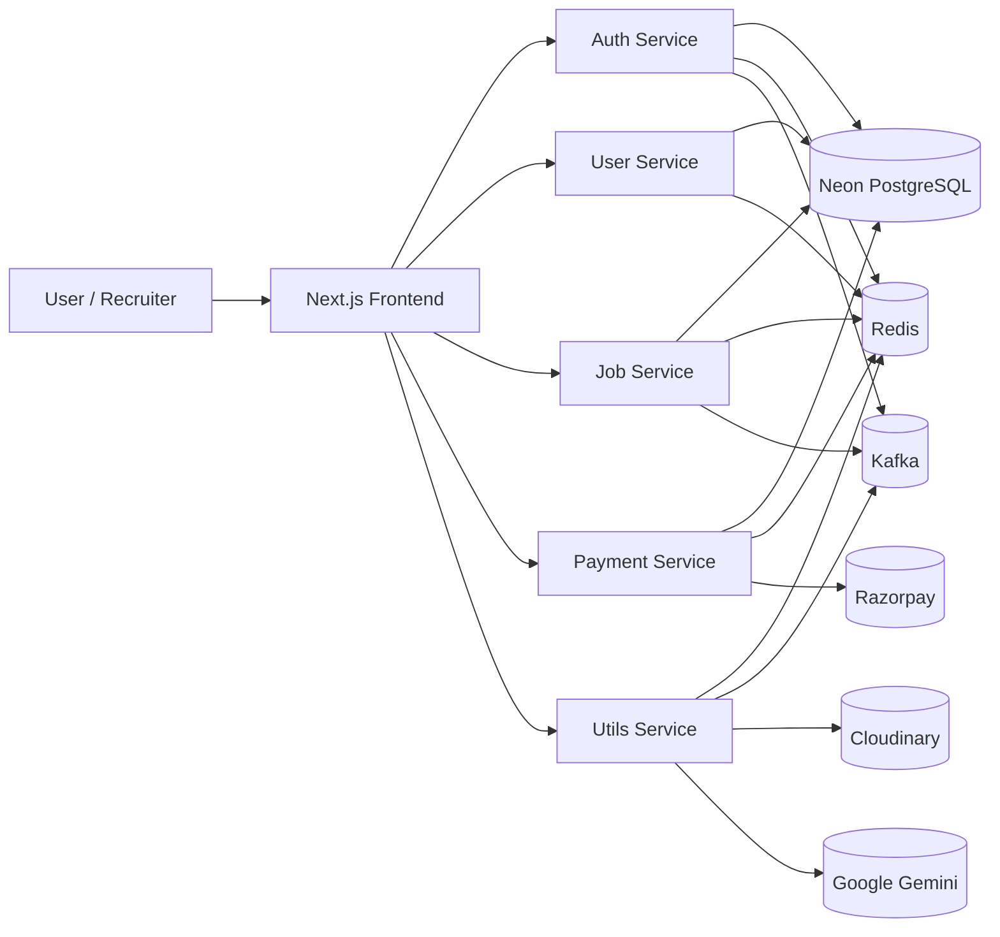
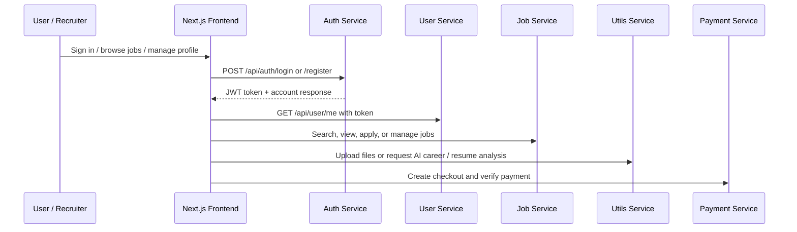

# HireHeaven - AI-Powered Microservices Job Portal


HireHeaven is a modern job portal built with a microservices architecture and a polished Next.js frontend. It connects job seekers, recruiters, and AI-driven career tools into one production-style platform for discovering jobs, managing applications, posting opportunities, analyzing resumes, and generating personalized career guidance.

The project was designed to demonstrate real-world engineering depth: authenticated user flows, role-based experiences, external service integrations, AI-assisted features, and service-oriented backend boundaries.

## Key Features

- Role-based experience for job seekers and recruiters.
- JWT-authenticated account management and profile updates.
- Job browsing, searching, application tracking, and recruiter job posting.
- Company management for recruiter workflows.
- AI-powered resume ATS analysis.
- AI-powered career path recommendations from skill inputs.
- Subscription and payment flow powered by Razorpay.
- File upload support for resumes, profile photos, and company logos.
- Event-driven backend components using Kafka and Redis.
- Redis-backed rate limiting on every service (stricter limits on auth, payment, and AI endpoints) to protect against brute force and abuse.
- Redis cache-aside layer for job listings, job details, company details, and user profiles, with explicit invalidation on writes.
- Cloudinary-based media storage and Gemini-powered AI responses.
- One-command local startup via Docker Compose (Redis, Kafka/Zookeeper, and all five services).

## Project Architecture

The system is split into a Next.js frontend and five backend services. Each service owns its own responsibility and communicates through HTTP, shared data stores, and asynchronous infrastructure where needed.



Redis serves two purposes here: rate limiting (every service throttles requests per client IP, with tighter windows on login/register/forgot, payment checkout/verify, and the AI/upload endpoints) and cache-aside reads (job listings, job details, company details, and user profiles), invalidated whenever the underlying data changes.

### Workflow Overview



## Tech Stack

| Layer | Technologies |
| --- | --- |
| Frontend | Next.js 16, React 19, TypeScript, Tailwind CSS 4 |
| UI Primitives | Radix UI, Lucide React, next-themes, react-hot-toast |
| HTTP Client | Axios |
| Auth | JWT, cookies |
| Backend | Node.js, Express 5, TypeScript |
| Database | Neon PostgreSQL |
| Cache / Rate Limiting | Redis (cache-aside reads + sliding-window rate limiting) |
| Messaging | Kafka / KafkaJS |
| File Storage | Cloudinary |
| Payments | Razorpay |
| AI Services | Google Gemini |
| Mail / Notifications | Nodemailer |

## Folder Structure

```text
job-portal/
├── frontend/                  # Next.js application
│   ├── src/
│   │   ├── app/               # App Router pages and routes
│   │   ├── components/        # Shared UI and feature components
│   │   ├── context/           # Global app state and service URLs
│   │   ├── lib/               # Shared utilities
│   │   └── type.ts            # Shared TypeScript types
│   ├── public/                # Static assets
│   └── package.json
├── services/
│   ├── auth/                  # Authentication microservice
│   ├── job/                   # Job and company microservice
│   ├── payment/               # Razorpay payment microservice
│   ├── user/                  # Profile, skills, and application microservice
│   └── utils/                 # AI, uploads, and notification utilities
└── README.md
```

## Installation Guide

### Prerequisites

- Node.js 20+ recommended
- npm 10+ recommended
- Docker + Docker Compose (only needed if you want Redis/Kafka running locally via the provided `docker-compose.yml`)
- Neon PostgreSQL database (free tier works — the services use `@neondatabase/serverless`, which speaks Neon's HTTP protocol, so a generic local Postgres container will not work as a drop-in replacement)
- Redis instance (local via Docker Compose, or a hosted instance such as Upstash/Redis Cloud)
- Kafka broker (local via Docker Compose, or a hosted instance such as Upstash Kafka/Confluent Cloud)
- Cloudinary account
- Razorpay account
- Google Gemini API key

### Quick Start (Docker Compose)

The fastest way to get Redis, Kafka, and all five backend services (plus the frontend) running together:

```bash
docker compose up --build
```

This starts Redis and Kafka/Zookeeper first, then builds and runs `auth` (5000), `utils` (5001), `user` (5002), `job` (5003), `payment` (5004), and the `frontend` (3000). Each service still reads its own `.env` file for the values Docker Compose doesn't override (`DB_URL`, `JWT_SEC`, Cloudinary, Razorpay, and Gemini credentials) — see below.

### Manual Setup

1. Clone the repository.
2. Install dependencies for each app:

```bash
cd frontend && npm install
cd ../services/auth && npm install
cd ../job && npm install
cd ../payment && npm install
cd ../user && npm install
cd ../utils && npm install
```

3. Each service already ships a `.env` file pre-filled with working local defaults for `PORT`, `JWT_SEC` (shared across auth/job/payment/user so tokens verify across services), `Redis_url` (`redis://localhost:6379`), and `Kafka_Broker` (`localhost:9092`). You only need to fill in the real, account-specific values: `DB_URL` (Neon), Cloudinary keys, `Razorpay_Key`/`Razorpay_Secret`, and `API_KEY_GEMINI`. **Treat these `.env` files as local-development convenience only — rotate every secret before using this project anywhere public, and never commit real production credentials.**
4. Start Redis and Kafka yourself (or via `docker compose up redis zookeeper kafka`) if you're running services with `npm run dev` instead of Docker Compose.

## Environment Variables

### Auth Service (`services/auth/.env`)

```env
PORT=5000
DB_URL=your_neon_postgres_connection_string
UPLOAD_SERVICE=http://localhost:5001
JWT_SEC=your_jwt_secret
Kafka_Broker=localhost:9092
Frontend_Url=http://localhost:3000
Redis_url=redis://localhost:6379
```

### User Service (`services/user/.env`)

```env
PORT=5002
DB_URL=your_neon_postgres_connection_string
UPLOAD_SERVICE=http://localhost:5001
JWT_SEC=your_jwt_secret
Redis_url=redis://localhost:6379
```

### Job Service (`services/job/.env`)

```env
PORT=5003
DB_URL=your_neon_postgres_connection_string
UPLOAD_SERVICE=http://localhost:5001
JWT_SEC=your_jwt_secret
Kafka_Broker=localhost:9092
Redis_url=redis://localhost:6379
```

### Payment Service (`services/payment/.env`)

```env
PORT=5004
Razorpay_Key=your_razorpay_key_id
Razorpay_Secret=your_razorpay_secret
DB_URL=your_neon_postgres_connection_string
JWT_SEC=your_jwt_secret
Redis_url=redis://localhost:6379
```

### Utils Service (`services/utils/.env`)

```env
PORT=5001
CLOUD_NAME=your_cloudinary_cloud_name
API_KEY=your_cloudinary_api_key
API_SECRET=your_cloudinary_api_secret
Kafka_Broker=localhost:9092
SMTP_USER=your_smtp_email@gmail.com
SMTP_PASS=your_smtp_app_password
API_KEY_GEMINI=your_gemini_api_key
Redis_url=redis://localhost:6379
```

### Frontend Configuration (`frontend/.env`)

The frontend reads its backend base URLs from environment variables (see `frontend/src/context/AppContext.tsx`), defaulting to `localhost` if unset:

```env
NEXT_PUBLIC_AUTH_SERVICE_URL=http://localhost:5000
NEXT_PUBLIC_UTILS_SERVICE_URL=http://localhost:5001
NEXT_PUBLIC_USER_SERVICE_URL=http://localhost:5002
NEXT_PUBLIC_JOB_SERVICE_URL=http://localhost:5003
NEXT_PUBLIC_PAYMENT_SERVICE_URL=http://localhost:5004
```

For a deployed environment, point these at your deployed service URLs instead.

## Running the Project

Each service can be started independently.

### Frontend

```bash
cd frontend
npm run dev
```

### Backend Services

```bash
cd services/auth && npm run dev
cd services/job && npm run dev
cd services/payment && npm run dev
cd services/user && npm run dev
cd services/utils && npm run dev
```

### Production Build

```bash
cd frontend && npm run build && npm run start
cd services/auth && npm run build && npm run start
cd services/job && npm run build && npm run start
cd services/payment && npm run build && npm run start
cd services/user && npm run build && npm run start
cd services/utils && npm run build && npm run start
```

## Deployment

Every service and the frontend already has its own `Dockerfile`, so each can be deployed independently as a container:

- **Frontend**: deploy to Vercel (native Next.js support) or as the `frontend` container to any Docker host; set the `NEXT_PUBLIC_*_SERVICE_URL` variables to your deployed backend URLs.
- **Backend services**: deploy each (`auth`, `user`, `job`, `payment`, `utils`) as a separate container to Render, Railway, Fly.io, or any container platform. Set each service's environment variables (from the tables above) in that platform's dashboard/secrets manager rather than committing real values.
- **Redis**: use a managed instance (Upstash, Redis Cloud, or your platform's managed Redis add-on) and point `Redis_url` at it.
- **Kafka**: use a managed instance (Upstash Kafka, Confluent Cloud) and point `Kafka_Broker` at it. All Kafka calls are wrapped in try/catch and log-and-continue on failure, so the app still runs (without async email/notification delivery) if Kafka is unreachable.
- **Database**: Neon PostgreSQL is already serverless and requires no separate hosting — just use your project's connection string as `DB_URL` in each deployed service.
- `docker-compose.yml` at the repo root is intended for local development; for production, run each service as its own deployment so they can scale and fail independently, which is the point of a microservices architecture.

## API Endpoints

### Auth Service

| Method | Endpoint | Description |
| --- | --- | --- |
| POST | `/api/auth/register` | Register a user with profile upload support |
| POST | `/api/auth/login` | Authenticate and issue a token |
| POST | `/api/auth/forgot` | Start password reset flow |
| POST | `/api/auth/reset/:token` | Complete password reset |

### User Service

| Method | Endpoint | Description |
| --- | --- | --- |
| GET | `/api/user/me` | Get the authenticated user profile |
| GET | `/api/user/:userId` | Get public user details |
| PUT | `/api/user/update/profile` | Update basic profile fields |
| PUT | `/api/user/update/pic` | Update profile image |
| PUT | `/api/user/update/resume` | Update resume file |
| POST | `/api/user/skill/add` | Add a skill |
| PUT | `/api/user/skill/delete` | Remove a skill |
| POST | `/api/user/apply/job` | Apply for a job |
| GET | `/api/user/application/all` | List user applications |

### Job Service

| Method | Endpoint | Description |
| --- | --- | --- |
| POST | `/api/job/company/new` | Create a new company |
| DELETE | `/api/job/company/:companyId` | Delete a company |
| GET | `/api/job/company/all` | List recruiter companies |
| GET | `/api/job/company/:id` | Get company details |
| POST | `/api/job/new` | Create a job posting |
| PUT | `/api/job/:jobId` | Update a job posting |
| GET | `/api/job/all` | Get all active jobs |
| GET | `/api/job/:jobId` | Get a single job |
| GET | `/api/job/application/:jobId` | Get applications for a job |
| PUT | `/api/job/application/update/:id` | Update an application status |

### Payment Service

| Method | Endpoint | Description |
| --- | --- | --- |
| POST | `/api/payment/checkout` | Create a Razorpay checkout order |
| POST | `/api/payment/verify` | Verify payment success |

### Utils Service

| Method | Endpoint | Description |
| --- | --- | --- |
| POST | `/api/utils/upload` | Upload or replace media in Cloudinary |
| POST | `/api/utils/career` | Generate career guidance using Gemini |
| POST | `/api/utils/resume-analyser` | Analyze a resume for ATS compatibility |

## Screenshots

### Home Page

> Screenshot of after deployment.

### Job Listings

> Screenshot of after deployment.

### Recruiter Dashboard

> Screenshot of after deployment.

### Resume Analyzer

> Screenshot of after deployment.

### Career Guide

> Screenshot of after deployment.

## Future Improvements

- Add centralized API gateway and service discovery instead of the frontend calling each service directly.
- Introduce automated tests (unit + integration) for frontend and backend services — currently none exist.
- Add Kubernetes manifests / Helm chart for production orchestration beyond the local Docker Compose setup.
- Improve observability with structured logging, request tracing, and metrics (e.g. OpenTelemetry + Prometheus/Grafana).
- Add pagination, sorting, and advanced filters for the job search flow.
- Add admin moderation for companies, job posts, and suspicious applications.
- Move `.env` files out of version control (use `.env.example` + a secrets manager) once this project is used for anything beyond local evaluation.
- Add a shared internal package (or npm workspace) for the duplicated `TryCatch`/`ErrorHandler`/`redisClient`/`rateLimiter` utilities instead of copy-pasting them into every service.
- Add CI (lint, typecheck, build, test) via GitHub Actions on every push/PR.

## Challenges Solved

- Coordinating a multi-service architecture without losing feature cohesion.
- Keeping recruiter and job seeker flows separate while sharing a common UX.
- Managing authenticated requests across services with token-based access.
- Handling binary uploads for resumes, logos, and profile media.
- Returning structured JSON from AI models reliably enough for UI rendering.
- Integrating payment, messaging, storage, and AI systems into one workflow.

## Learning Outcomes

- Microservices design and service boundary definition.
- Frontend state orchestration with React context.
- Secure auth flows using JWT and cookie-based sessions.
- Database modeling for job portals, applications, and user skills.
- Practical integration of third-party APIs and hosted services.
- Real-world TypeScript patterns across frontend and backend codebases.

## Why This Project Stands Out

- It combines a polished consumer-facing frontend with a production-style distributed backend.
- It solves a real hiring workflow end to end, from discovery to application to payment.
- It adds AI features that are useful rather than ornamental: resume analysis and career guidance.
- It demonstrates integration depth across databases, storage, caching, messaging, and payments.
- It is recruiter-friendly because the domain, architecture, and feature scope are immediately understandable.

## License

Licensed under the ISC License.
